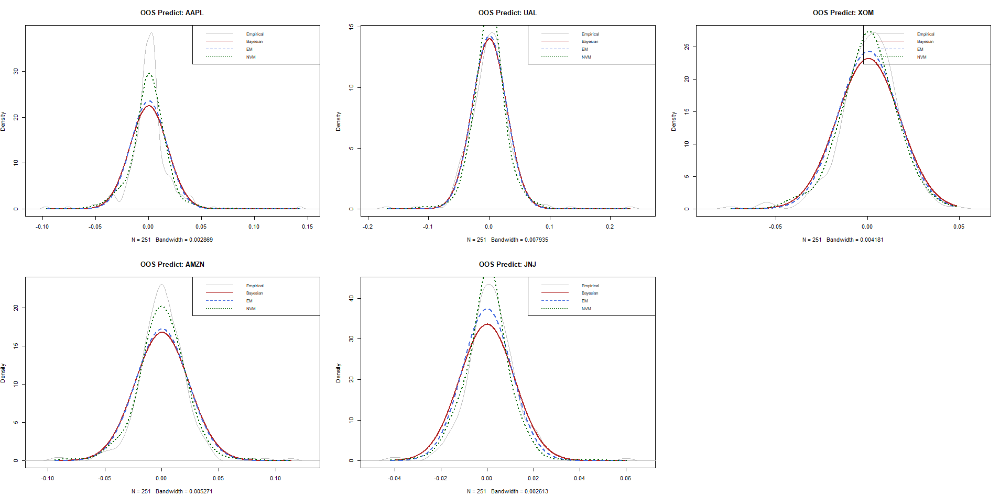

# StatisticalResearchJMU
A place to put my statistical research that I have been working on at james madison university

### Credits & Citation
* **Algorithm Design:** The `NVMunmix` logic and underlying methodology were developed by **Dr. Hasan Hamdan**.
* **Implementation & Research:** The Gibbs Sampler, the comparative framework (EM vs. Bayesian vs. NVM), and the empirical study on US Stock returns were developed and implemented by **Nathan Carter**.

**To cite this specific project:**
Carter, N., & Hamdan, H. (2026). Normal Mixture Density Estimation for Major US Stocks: A Four-Year Empirical Study. 
GitHub: [github.com/Synitrax/StatisticalResearchJMU](https://github.com/Synitrax/StatisticalResearchJMU)
