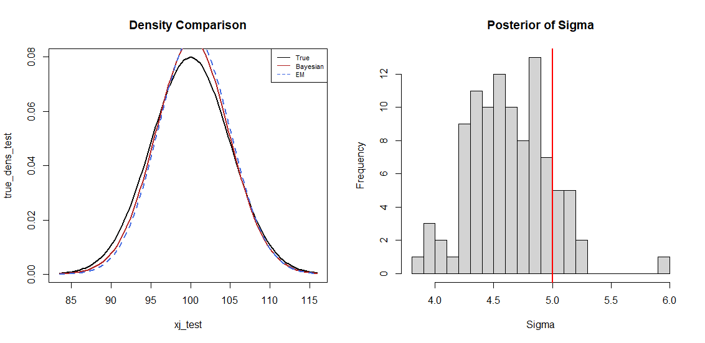
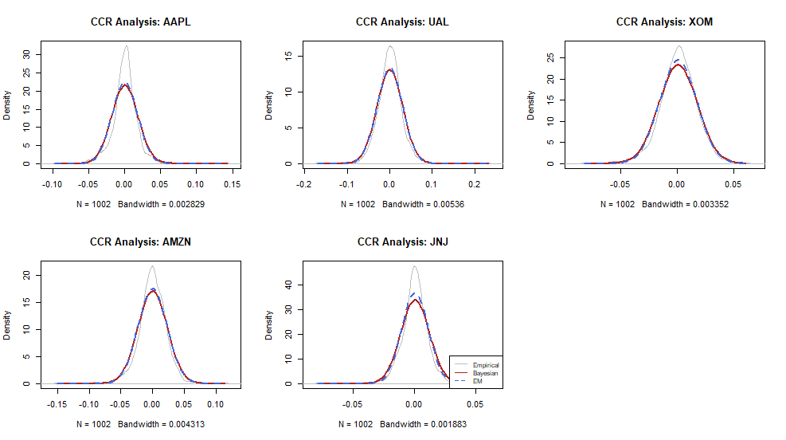

# Statistical Research at JMU
### Normal Mixture Density Estimation for Major US Stocks: A Four-Year Empirical Study

Welcome to the central repository for my statistical research conducted at **James Madison University**. This project explores high-dimensional density estimation using various computational frameworks.

---

## 📊 Research Presentation
This research was featured at the **MAA MD-VA-DC Section Meeting** in Spring 2026.

* 📄 [**Download the Full Presentation (PDF)**](./Presentation/JMU_Stats_Research%20(1).pdf)

## 📈 Key Findings & Visuals

### Model Comparison
Analysis of the `NVMunmix` logic compared against standard EM and our Bayesian algorithms.

### Theoretical Framework
Testing the robustness of the Bayesian vs. EM approach.

### Stock Market Application
Empirical study results focusing on four-year US stock returns (Between EM and Bayesian).

---

## 🤝 Credits & Acknowledgments
* **Algorithm Design:** The `NVMunmix` logic and underlying methodology were developed by **Dr. Hasan Hamdan**.
* **Implementation & Research:** The Gibbs Sampler, the comparative framework (EM vs. Bayesian vs. NVM), and the empirical study were developed and implemented by **Nathan Carter**.

## 📝 Citation
If you use this logic or data in your research, please cite as follows:

> Carter, N., & Hamdan, H. (2026). *Normal Mixture Density Estimation for Major US Stocks: A Four-Year Empirical Study*. James Madison University. [github.com/Synitrax/StatisticalResearchJMU](https://github.com/Synitrax/StatisticalResearchJMU)
